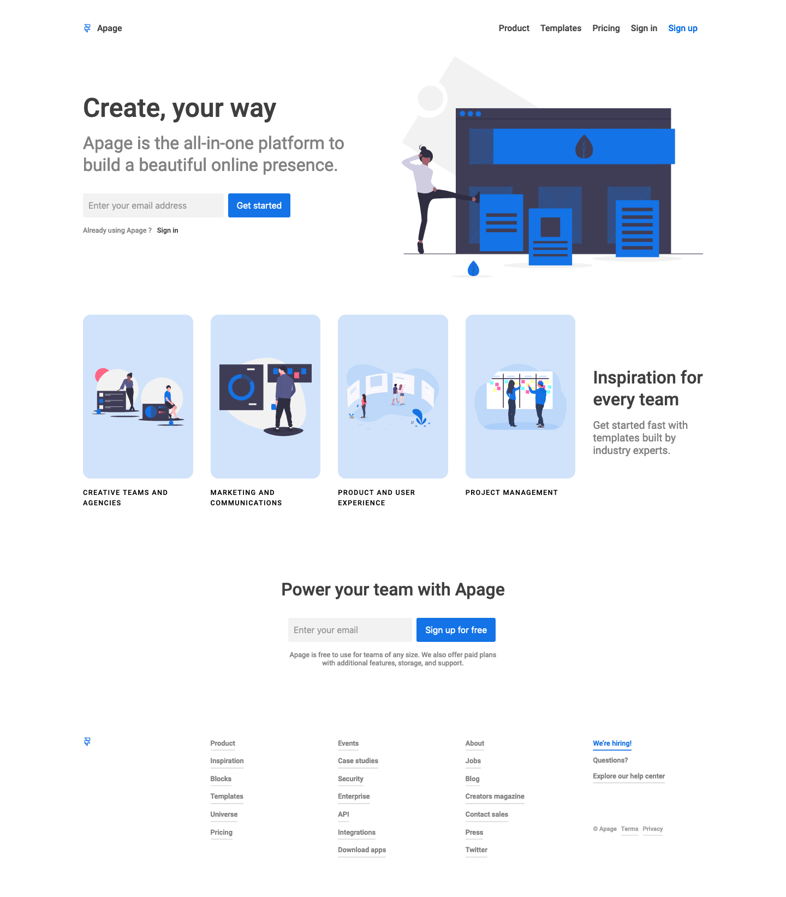

# Apage client

[](https://github.com/styled-components/styled-components)
[](https://github.com/prettier/prettier)
[](https://github.com/malcodeman/apage-client/blob/master/LICENSE)

Single-page websites for all kinds of things.



## Getting started

First, clone and run the api:

```
git clone https://github.com/malcodeman/apage-api.git apage-api
cd apage-api
yarn install && yarn start
```

Next, you can clone and run the frontend:

```
git clone https://github.com/malcodeman/apage-client.git apage-client
cd apage-client
yarn install && yarn start
```

.env.development.local:

```
REACT_APP_API_URL = "http://localhost:4000/api/"
```

## License

[MIT](./LICENSE)
